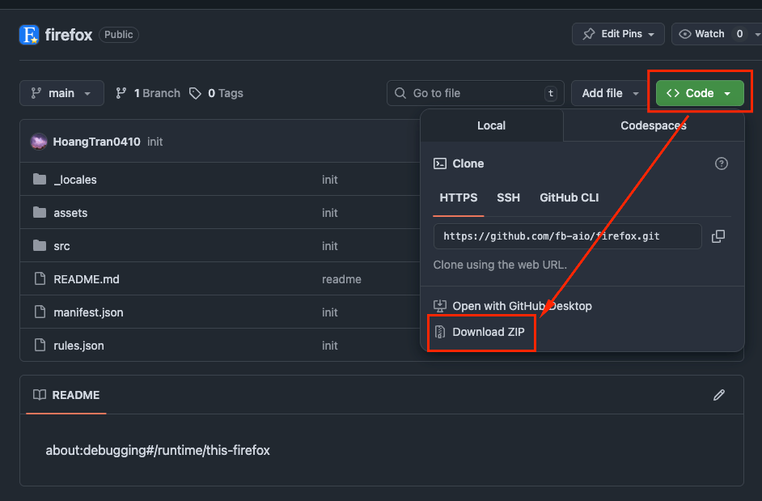
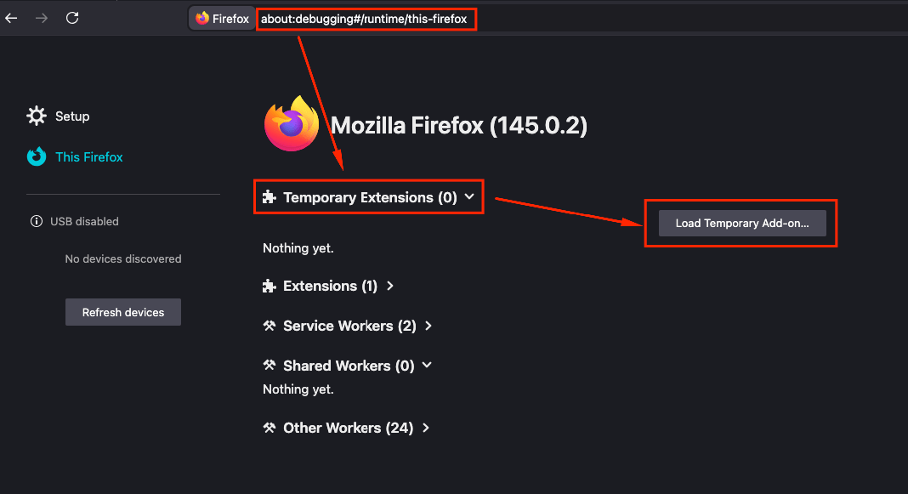
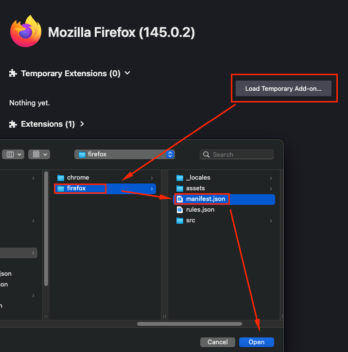

# FB AIO Extension for Firefox

## Installation

### Firefox Add-on Store

*Coming soon...*

### Temporary Load for Development

1. Download this repo into zip and extract it

2. Open Firefox and go to `about:debugging#/runtime/this-firefox`
3. Click on "Load Temporary Add-on"

4. Select the `manifest.json` file from the downloaded repo

